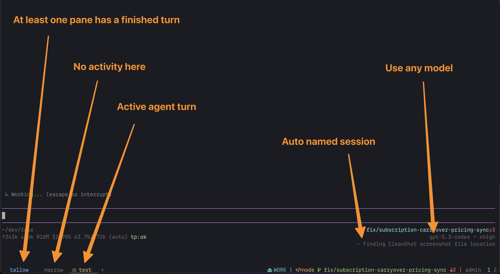

<p align="center">
  
</p>

<h1 align="center">Tallow</h1>

<p align="center">
  A modular coding agent for your terminal. Built on <a href="https://github.com/nicobrinkkemper/pi-coding-agent">pi</a>.
</p>

<p align="center">
  <a href="https://tallow.dungle-scrubs.com">Docs</a> · <a href="https://github.com/dungle-scrubs/tallow">GitHub</a>
</p>

<p align="center">
  <a href="https://github.com/dungle-scrubs/tallow/actions/workflows/ci.yml"></a>
  <a href="https://www.npmjs.com/package/tallow"></a>
  <a href="https://img.shields.io/badge/Bun-%E2%89%A51.3.9-f9f1e1?logo=bun"></a>
  <a href="https://tallow.dungle-scrubs.com"></a>
  <a href="https://opensource.org/licenses/MIT"></a>
</p>

---

<p align="center">
  
  <br />
  <sub>Shown with a customized <a href="https://wezfurlong.org/wezterm/">WezTerm</a> configuration.</sub>
</p>

Tallow is a terminal coding agent that starts minimal and scales up. Install only the
extensions, themes, and agents your project needs, or enable everything. It drops into
existing Claude Code projects via `.claude/` bridging, so nothing breaks when you switch.
Ships with 50 extensions, 34 themes, and 10 specialized agents.

## Quick start

```bash
npm install -g tallow   # or: pnpm add -g tallow / bun install -g tallow
tallow install          # pick extensions, themes, agents
tallow                  # start coding
```

Or try it without installing globally:

```bash
npx tallow install      # or: pnpm dlx tallow install / bunx tallow install
```

> Requires Node.js ≥ 22 and an API key for at least one LLM provider
> (Anthropic, OpenAI, Google, etc.)

<details>
<summary><strong>Install from source</strong></summary>

```bash
git clone https://github.com/dungle-scrubs/tallow.git
cd tallow
bun install
bun run build
node dist/install.js
```

The installer walks you through selecting extensions, themes, and agents,
then links the `tallow` binary globally.

</details>

## Highlights

**Multi-model routing** — Route tasks by intent and cost across providers.
`auto-cheap` for boilerplate, `auto-balanced` for everyday work, `auto-premium`
when accuracy matters.

**Multi-agent teams** — Spawn specialized agents that share a task board with
dependencies, messaging, and archive/resume. Coordinate complex work across
multiple models in parallel.

**Context fork** — Branch into an isolated subprocess with its own tools and model,
then merge results back into the main session.

**Workspace rewind** — Every conversation turn snapshots your file changes. Roll back
to any earlier turn when something goes wrong.

**Background tasks** — Kick off long-running work without blocking the session.
Track task lifecycle explicitly and check back when ready.

**LSP** — Jump to definitions, find references, inspect types, and search
workspace symbols — no editor required.

**Claude Code compatible** — Projects with `.claude/` directories (skills, agents,
commands) work without changes. Both `.tallow/` and `.claude/` are scanned;
`.tallow/` takes precedence.

**User-owned config** — Agents, commands, and extensions install to `~/.tallow/`
where you own them. Edit, remove, or add your own.

## Usage

```bash
# Interactive session
tallow

# Single-shot prompt
tallow -p "Fix the failing tests"

# Pipe in context
git diff | tallow -p "Review these changes"
cat src/main.ts | tallow -p "Find bugs in this code"

# Continue the last session
tallow --continue

# Pick a model and thinking level
tallow -m anthropic/claude-sonnet-4-20250514 --thinking high

# List saved sessions
tallow --list

# Restrict available tools
tallow --tools readonly            # read, grep, find, ls only
tallow --tools none                # chat only, no tools
```

### Extension catalog + least-privilege startup

Use the extension catalog to inspect what each extension does:

```bash
tallow extensions          # table view (default)
tallow extensions --json   # machine-readable catalog
tallow extensions tasks    # details for one extension ID
```

For least-privilege sessions, start from an explicit allowlist:

```bash
tallow --extensions-only --extension tasks --extension lsp
tallow --extensions-only --extension read-tool-enhanced --extension write-tool-enhanced
```

Repeat `--extension <selector>` to add only what the task needs.

See the [full CLI reference](https://tallow.dungle-scrubs.com) for all flags
and modes (RPC, JSON, piped stdin, shell interpolation, etc.)

## Configuration

Tallow stores its configuration in `~/.tallow/`:

| Path | Purpose |
|------|---------|
| `settings.json` | Global settings (theme, icons, keybindings) |
| `.env` | Environment variables loaded at startup (supports `op://` refs) |
| `auth.json` | Provider auth references (see [SECURITY.md](SECURITY.md)) |
| `models.json` | Model configuration |
| `agents/` | Agent profiles — yours to edit |
| `commands/` | Slash commands — yours to edit |
| `extensions/` | User extensions (override bundled ones by name) |
| `sessions/` | Persisted conversation sessions |

Project-level overrides live in `.tallow/` within your repo.

## Extending Tallow

### Themes

Switch themes in-session with `/theme`, or set a default:

```json
{ "theme": "tokyo-night" }
```

### Icons

Override any TUI glyph in `settings.json` — only the keys you set change:

```json
{ "icons": { "success": "✔", "error": "✘" } }
```

See the [icon reference](https://tallow.dungle-scrubs.com/getting-started/icons/) for all keys.

### Writing extensions

Extensions are TypeScript files that receive the pi `ExtensionAPI`:

```typescript
import type { ExtensionAPI } from "tallow";

export default function myExtension(api: ExtensionAPI): void {
  api.registerCommand("greet", {
    description: "Say hello",
    handler: async (_args, ctx) => {
      ctx.ui.notify("Hello from my extension!", "info");
    },
  });
}
```

Place it in `~/.tallow/extensions/my-extension/index.ts`. If it shares a name
with a bundled extension, yours takes precedence.

### SDK

Embed Tallow in your own scripts:

```typescript
import { createTallowSession } from "tallow";

const { session } = await createTallowSession({
  provider: "anthropic",
  modelId: "claude-sonnet-4-20250514",
});

session.subscribe((event) => {
  if (event.type === "message_update" && event.assistantMessageEvent.type === "text_delta") {
    process.stdout.write(event.assistantMessageEvent.delta);
  }
});

await session.prompt("What files are in this directory?");
session.dispose();
```

See the [SDK docs](https://tallow.dungle-scrubs.com) for all options.

## Known limitations

- Requires Node.js 22+ (uses modern ESM features)
- Session persistence is local — no cloud sync
- `web_fetch` works best with a [Firecrawl](https://firecrawl.dev) API key for JS-heavy pages

## Contributing

See [CONTRIBUTING.md](CONTRIBUTING.md) for development setup and guidelines.

This is a personal project I build in my spare time — please be patient with
issue and PR response times.

## License

[MIT](LICENSE) © Kevin Frilot
