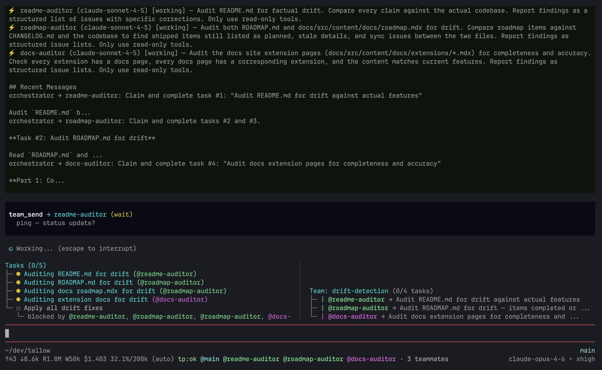

<p align="center">
  
</p>

<h1 align="center">Tallow</h1>

<p align="center">
  An opinionated coding agent. Built on <a href="https://github.com/nicobrinkkemper/pi-coding-agent">pi</a>.
</p>

<p align="center">
  <a href="https://tallow.dungle-scrubs.com">Docs</a> · <a href="https://github.com/dungle-scrubs/tallow">GitHub</a>
</p>

<p align="center">
  <a href="https://github.com/dungle-scrubs/tallow/actions/workflows/ci.yml"></a>
  <a href="https://opensource.org/licenses/MIT"></a>
</p>

---

<p align="center">
  
</p>

43 extensions, 34 themes, 8 slash commands, and 8 specialized agents.
Install only what you need — the interactive installer lets you pick.

## Features

- **43 bundled extensions** — enhanced tools, hooks, tasks, teams, LSP, themes, context usage, and more
- **34 terminal themes** — Tokyo Night, Catppuccin, Gruvbox, Rose Pine, Nord, and many others
- **8 slash commands** — `/implement`, `/implement-and-review`, `/review`, `/fix`, `/test`, `/scout-and-plan`, `/scaffold`, `/question`
- **8 specialized agents** — architect, debug, planner, refactor, reviewer, scout, worker, tallow-expert
- **Multi-agent teams** — coordinate multiple agents with task boards, messaging, and archive/resume
- **Session naming** — auto-generated descriptive names for each session, shown in footer and `--list`
- **Context fork** — run skills and commands in isolated subprocesses via `context: fork` frontmatter
- **Debug mode** — structured JSONL diagnostic logging with `/diag` command
- **Claude Code compatible** — `.claude/` directory bridging for seamless use of Tallow skills, agents, and commands in Claude Code
- **SDK** — embed Tallow in your own scripts and orchestrators
- **User-owned config** — agents and commands are installed to `~/.tallow/` where you can edit, remove, or add your own

Read the full [documentation](https://tallow.dungle-scrubs.com).

## Requirements

- Node.js ≥ 22
- An API key for at least one supported LLM provider (Anthropic, OpenAI, Google, etc.)

## Installation

### Global install

```bash
bun install -g tallow
tallow install
```

Or without global install:

```bash
bunx tallow install
```

### From source

```bash
git clone https://github.com/dungle-scrubs/tallow.git
cd tallow
bun install
bun run build
node dist/install.js
```

The installer walks you through selecting extensions, themes, and agents,
then links the `tallow` binary globally.

## Usage

```bash
# Interactive mode
tallow

# Single-shot prompt
tallow -p "Fix the failing tests"

# Continue most recent session
tallow --continue

# Use a specific model
tallow -m anthropic/claude-sonnet-4-20250514

# Set thinking level
tallow --thinking high

# Run without persisting session
tallow --no-session

# Load additional extensions
tallow -e ./my-extension

# List saved sessions (shows auto-generated names)
tallow --list

# Runtime auth via environment (not persisted)
TALLOW_API_KEY=sk-ant-... tallow --provider anthropic

# Runtime auth via reference (resolved at runtime)
TALLOW_API_KEY_REF=op://Services/Anthropic/api-key tallow --provider anthropic

# Run in RPC or JSON mode
tallow --mode rpc

# Disable all extensions
tallow --no-extensions

# Print tallow home directory
tallow --home
```

`--api-key` was removed to avoid leaking secrets in process arguments.
Use `TALLOW_API_KEY` or `TALLOW_API_KEY_REF` instead.

### Shell interpolation

Expand shell commands inline with `` !`command` `` syntax:

```
!`ls -la`
!`git status`
!`git branch --show-current`
```

**Disabled by default.** Enable explicitly with either:

- `TALLOW_ENABLE_SHELL_INTERPOLATION=1` (or `TALLOW_SHELL_INTERPOLATION=1`)
- `"shellInterpolation": true` in `.tallow/settings.json` or `~/.tallow/settings.json`

When enabled, only allowlisted implicit commands run. The command output
replaces the pattern before reaching the agent. 5-second timeout, 1 MB
max output, non-recursive. High-risk explicit shell commands require
confirmation (`TALLOW_ALLOW_UNSAFE_SHELL=1` bypasses confirmation in
non-interactive environments).

### Slash commands

Inside an interactive session, type `/` to see available commands:

| Command | Description |
|---------|-------------|
| `/implement` | Implement a feature from a description |
| `/implement-and-review` | Implement then self-review |
| `/review` | Review recent changes |
| `/fix` | Fix a bug from a description |
| `/test` | Write or fix tests |
| `/scout-and-plan` | Explore the codebase and create a plan |
| `/scaffold` | Scaffold a new project |
| `/question` | Ask a question about the codebase |

## SDK

Use Tallow programmatically in your own tools:

```typescript
import { createTallowSession } from "tallow";

const { session } = await createTallowSession({
  provider: "anthropic",
  modelId: "claude-sonnet-4-20250514",
});

session.subscribe((event) => {
  if (event.type === "message_update" && event.assistantMessageEvent.type === "text_delta") {
    process.stdout.write(event.assistantMessageEvent.delta);
  }
});

await session.prompt("What files are in this directory?");
session.dispose();
```

### SDK options

```typescript
const tallow = await createTallowSession({
  cwd: "/path/to/project",
  provider: "anthropic",
  modelId: "claude-sonnet-4-20250514",
  thinkingLevel: "high",
  session: { type: "memory" },        // Don't persist
  noBundledExtensions: true,           // Start clean
  additionalExtensions: ["./my-ext"],   // Add your own
  systemPrompt: "You are a test bot.",  // Override system prompt
  apiKey: process.env.ANTHROPIC_API_KEY, // Runtime only, not persisted
});
```

## Configuration

Tallow stores its configuration in `~/.tallow/`:

| Path | Purpose |
|------|---------|
| `~/.tallow/settings.json` | Global settings |
| `~/.tallow/auth.json` | Provider auth references (see [SECURITY.md](SECURITY.md)) |
| `~/.tallow/models.json` | Model configuration |
| `~/.tallow/keybindings.json` | Keybinding overrides |
| `~/.tallow/agents/` | Agent profiles (installed from templates, yours to edit) |
| `~/.tallow/commands/` | Slash commands (installed from templates, yours to edit) |
| `~/.tallow/extensions/` | User extensions (override bundled ones by name) |
| `~/.tallow/sessions/` | Persisted conversation sessions |

Project-level configuration lives in `.tallow/` within your project directory.

## Icons

Override any TUI glyph in `~/.tallow/settings.json`:

```json
{
  "icons": {
    "success": "✔",
    "error": "✘",
    "spinner": ["⠋", "⠙", "⠹", "⠸"]
  }
}
```

Only keys you set are overridden — everything else keeps its default.
See the [icon reference](https://tallow.dungle-scrubs.com/getting-started/icons/) for all available keys.

## Themes

Switch themes inside an interactive session with the `/theme` command,
or set one in `~/.tallow/settings.json`:

```json
{
  "theme": "tokyo-night"
}
```

## Writing extensions

Extensions are TypeScript files that receive the pi `ExtensionAPI`:

```typescript
import type { ExtensionAPI } from "tallow";

export default function myExtension(api: ExtensionAPI): void {
  api.registerCommand("greet", {
    description: "Say hello",
    handler: async (_args, ctx) => {
      ctx.ui.notify("Hello from my extension!", "info");
    },
  });
}
```

Place your extension in `~/.tallow/extensions/my-extension/index.ts`.
If it shares a name with a bundled extension, yours takes precedence.

## Known limitations

- Requires Node.js 22+ (uses modern ESM features)
- Session persistence is local — no cloud sync
- The `web-fetch` extension works best with a [Firecrawl](https://firecrawl.dev) API key for JS-heavy pages

## Contributing

See [CONTRIBUTING.md](CONTRIBUTING.md) for development setup and guidelines.

## License

[MIT](LICENSE) © Kevin Frilot
